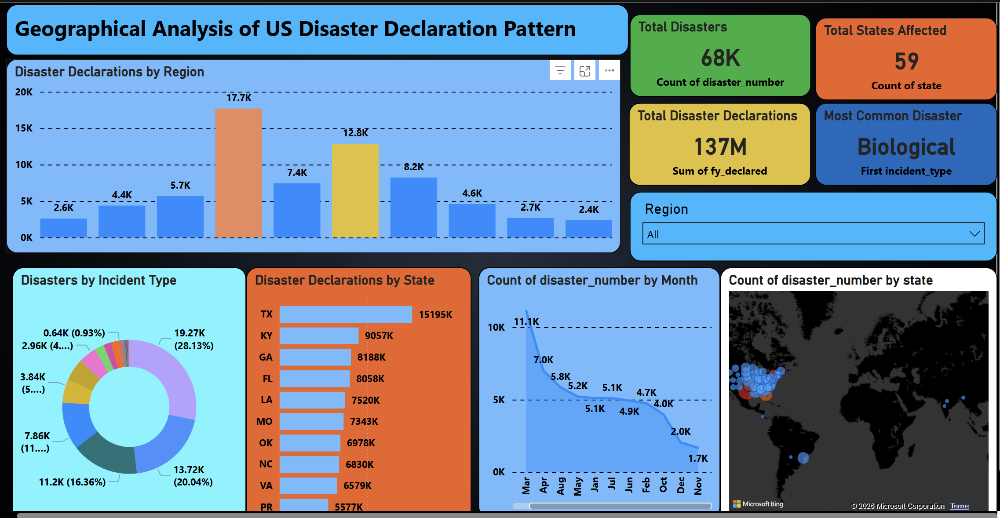
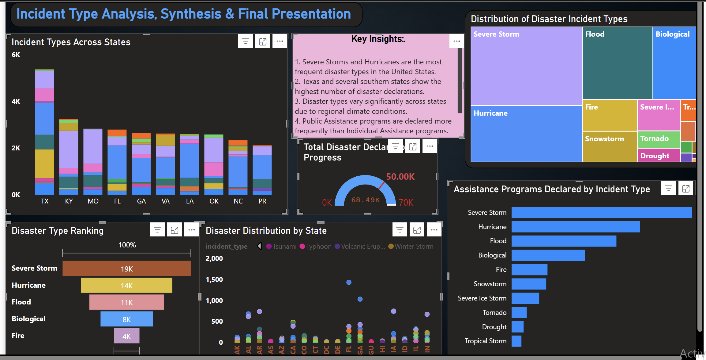
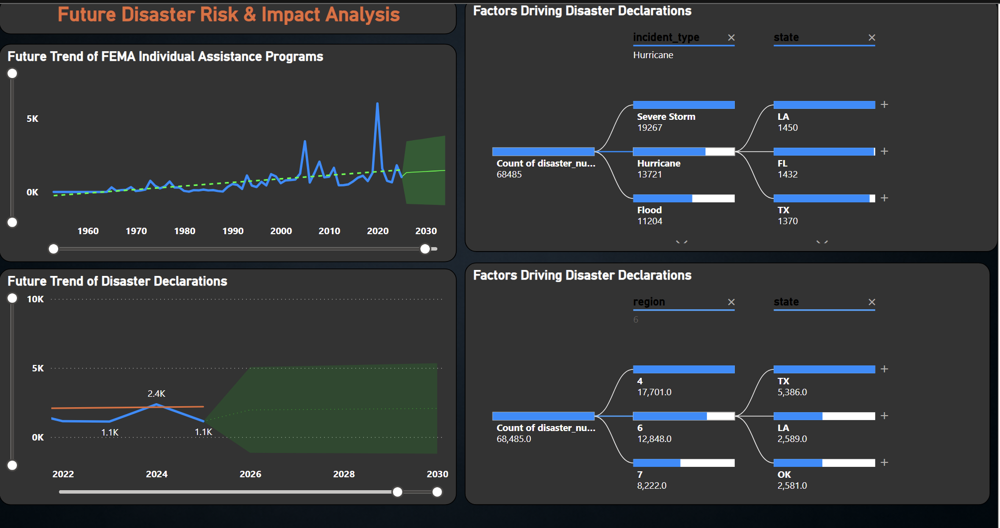

# 🌍 US Natural Disaster Analysis Dashboard

## 📌 Project Overview
This project focuses on analyzing US natural disaster declaration data using data analytics and visualization techniques. The goal is to identify patterns, trends, and key insights related to disaster occurrences across different states and regions.

---

## 🎯 Objectives
- Analyze disaster patterns across regions and states
- Identify the most common disaster types
- Perform temporal (time-based) analysis
- Understand future trends and impacts

---

## 🛠 Tools & Technologies Used
- Python (Pandas, NumPy)
- Power BI (Dashboard Visualization)
- Jupyter Notebook
- Data Analysis Techniques

---

## 📊 Milestones

### ✅ Milestone 1 & 2
- Data Cleaning and Preprocessing
- Exploratory Data Analysis (EDA)

### ✅ Milestone 3
- Geographical Analysis Dashboard

### ✅ Milestone 4
- Incident Type Analysis
- Future Trends and Impact Analysis

---

## 📸 Dashboard Screenshots

### 📍 Geographical Analysis

### 📊 Incident Analysis

### 📈 Future Trends

---

## 📁 Files Included
- Power BI Dashboard (.pbix file)
- Dataset
- Jupyter Notebooks
- Dashboard Screenshots

---

## 🔍 Key Insights
- Severe storms and hurricanes are the most frequent disasters
- Southern states show higher disaster occurrences
- Disaster patterns vary based on geography and climate
- Increasing trend in disaster declarations over time

---

## 🚀 Conclusion
This project provides meaningful insights into disaster trends in the US and helps in understanding risk patterns for better decision-making.

---

## 👨‍💻 Author
**Vaibhav Pratap Singh Rajawat**
